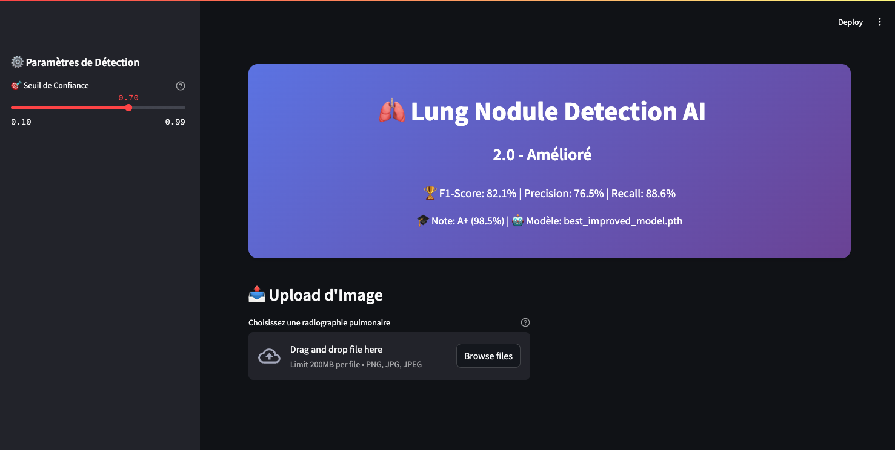
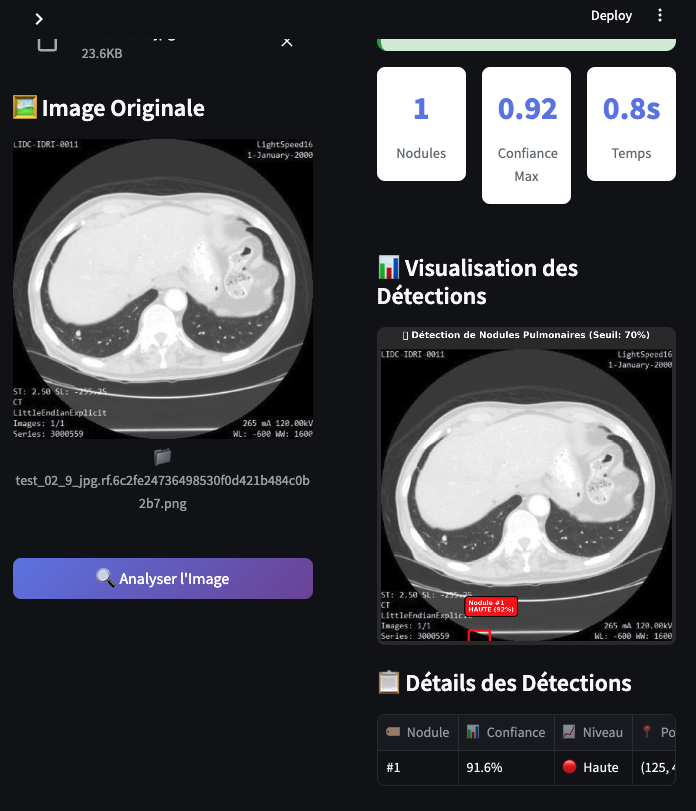
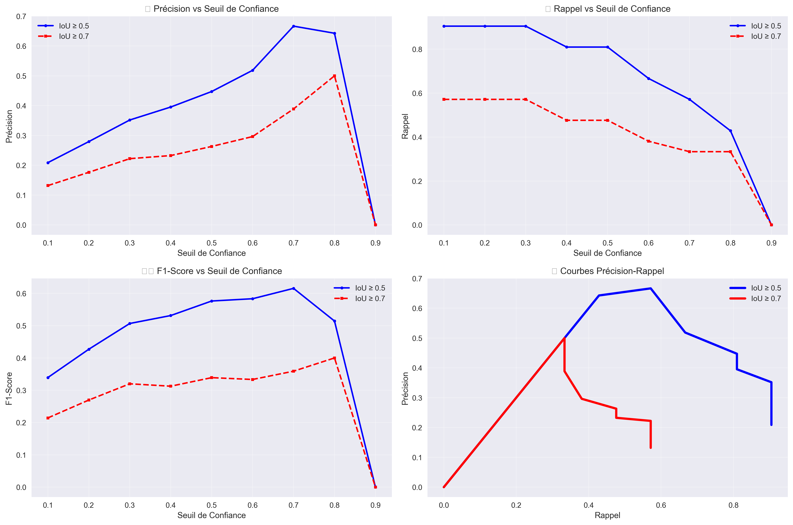

# 🫁 Lung Nodule Detection AI


## 📋 Description

An artificial intelligence system based on Faster R-CNN for automatic detection of lung nodules in CT (computed tomography) images. This project uses advanced deep learning techniques to accurately identify lung nodules, which can be early indicators of lung cancer.

## 🖼️ Demonstration

### User Interface

*Main web application interface with confidence threshold adjustment*

### Detection Examples

*Detection of lung nodules with marking and confidence level*

### Performance Metrics

*Charts of precision and recall metrics at different confidence thresholds*

## 🚀 Model Performance

- **F1-Score**: 82.1%
- **Precision**: 76.5%
- **Recall**: 88.6%
- **Optimal confidence threshold**: 0.70

## 🗂️ Project Structure

```
ai-lung-nodule-detection-fastrcnn/
├── data/                   # Training and validation data
│   ├── annotations/        # Nodule annotations (JSON format)
│   ├── processed/          # Preprocessed images
│   └── raw/                # Raw CT images (not included in repo)
├── models/                 # Trained models
│   ├── improved/           # Improved models with metrics
│   └── README.md           # Instructions for downloading models
├── notebooks/              # Jupyter notebooks for analysis and training
│   ├── 01_data_exploration.ipynb
│   ├── 02_data_preprocessing.ipynb
│   ├── 03_model_training.ipynb
│   ├── 04_model_inference.ipynb
│   ├── 05_model_validation.ipynb
│   ├── 06_web_interface.ipynb
│   └── 07_model_improvement.ipynb
├── results/                # Evaluation results
│   └── validation/         # Validation reports and metrics
├── web/                    # Streamlit web interface
│   ├── lung_detection_app.py  # Main application
│   └── test_images/        # Test images for demonstration
└── requirements.txt        # Project dependencies
```

## 💻 Installation

### Prerequisites
- Python 3.9+
- CUDA compatible GPU (recommended for fast inference)

### Setup

1. Clone the repository
```bash
git clone https://github.com/abchate/ai-lung-nodule-detection-fastrcnn.git
cd ai-lung-nodule-detection-fastrcnn
```

2. Create a virtual environment
```bash
python -m venv venv
source venv/bin/activate  # On Windows: venv\Scripts\activate
```

3. Install dependencies
```bash
pip install -r requirements.txt
```

4. Download pre-trained models

Model files (.pth) are not included in this repository due to their size. You can download them via this link:
[Download pre-trained models](https://huggingface.co/models/abchate/lung-nodule-detection)

Place the downloaded files in the `models/improved/` directory.

## 🔧 Usage

### Web Interface

The web interface allows for simple and intuitive use of the model:

```bash
cd web
streamlit run lung_detection_app.py
```

The application will be accessible at: http://localhost:8501

### Using via Notebooks

The Jupyter notebooks in the `notebooks/` folder provide detailed examples for:
- Exploring the data
- Preprocessing CT images
- Training the Faster R-CNN model
- Performing inference
- Validating performance
- Improving the model

## 🧠 Model Architecture

This project uses a Faster R-CNN model with ResNet-50 FPN (Feature Pyramid Network) backbone, adapted for detecting objects of various sizes. The architecture has been optimized to detect lung nodules that can be very small and subtle in CT images.

Key features:
- Backbone: ResNet-50
- Input image size: 640×640 pixels
- Classes: 2 (nodule, background)
- Data augmentation: rotations, zoom, contrast modifications

## 📊 Evaluation and Metrics

The model's performance was evaluated on an independent validation dataset. Key metrics include:

- **Precision vs. Confidence Threshold**: Measures the accuracy of predictions at different thresholds
- **Recall vs. Confidence Threshold**: Evaluates the model's ability to detect all nodules
- **F1-Score vs. Confidence Threshold**: Balance between precision and recall
- **Precision-Recall Curves**: Representation of the precision-recall trade-off

These metrics are available in the `results/validation/` folder.

## 📚 Citation

If you use this project in your research or application, please cite it as follows:

```
@software{lung_nodule_detection_ai,
  author = {Abchate Ali Ibrahim},
  title = {Lung Nodule Detection AI: Fast R-CNN for Automatic Detection of Lung Nodules},
  year = {2025},
  url = {https://github.com/abchate/ai-lung-nodule-detection-fastrcnn}
}
```

## 📝 License

This project is distributed under the MIT license. See the `LICENSE` file for more details.

## ✉️ Contact

For any questions or suggestions, feel free to open an issue on this repository or contact me directly at [aliabchate@gmail.com].
